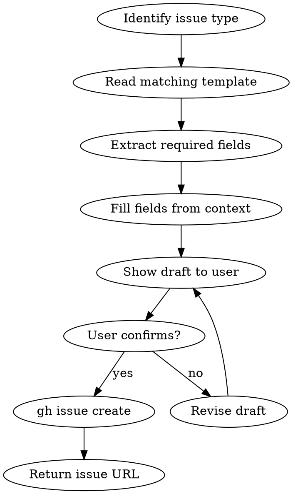

# GitHub Issue Creator

## Overview

Creates GitHub issues using the project's `.github/ISSUE_TEMPLATE/` forms. Reads template YAML to extract required fields, fills them from context, and files via `gh issue create`.

## When to Use

- User asks to create/file a GitHub issue
- User reports a bug, requests a feature, or identifies a security policy gap
- User wants to track work from a VlamGuard report as issues
- User says "open an issue", "file a bug", "create a ticket"

**When NOT to use:** GitLab projects (use `glab` instead), or when user just wants to discuss without filing.

## Quick Reference

| Template | Trigger | Labels |
|----------|---------|--------|
| `bug_report.yml` | Bug, error, unexpected behavior | `bug` |
| `feature_request.yml` | New feature, enhancement, improvement | `enhancement` |
| `security_vulnerability.yml` | Missing policy check, security gap | `security`, `policy` |

## Workflow



### Steps

1. **Identify template**: Match user intent to `bug_report`, `feature_request`, or `security_vulnerability`
2. **Read template**: Parse `.github/ISSUE_TEMPLATE/<template>.yml` to get field IDs, labels, and required flags
3. **Fill fields**: Use conversation context, VlamGuard output, or user-provided details to populate each field
4. **Draft body**: Format as markdown with `### <Label>` sections matching template field labels
5. **Use title prefix**: Templates specify `title:` (e.g. `"[Bug]: "`) — always prepend this prefix
6. **Confirm**: Show the user the title, labels, and body draft before filing
7. **Create**: Run `gh issue create --title "<title>" --label "<labels>" --body "<body>"`
8. **Return**: Display the issue URL

### Template Field Types

| Type | How to handle |
|------|---------------|
| `textarea` | Fill as markdown text under `### <Label>` |
| `input` | Fill as single-line text under `### <Label>` |
| `dropdown` | Pick closest matching option from the `options:` list, render as plain text |
| `markdown` | **Skip** — informational block, not a user field |

- **Required fields** (`required: true`): Must always be filled — never omit
- **Optional fields**: Include with best-effort content; use "N/A" if no context available
- **`render:` attribute** (e.g. `render: shell`): Wrap content in triple backticks with that language
- **Batch issues**: When creating multiple issues, prioritize by severity and create one at a time

### Body Format

Use `### <Label>` sections matching the template's field labels. Example for `bug_report.yml`:

```markdown
### Description
<filled from context>

### Steps to Reproduce
<filled or "N/A">

### Expected Behavior
<filled>

### Actual Behavior
<filled>
```

For other templates, read the `.yml` file and use its field `label:` values as section headers. Never hardcode — always derive from the template.

## Common Mistakes

- **Skipping confirmation**: Always show draft before filing. User may want to adjust.
- **Missing required fields**: Template marks fields `required: true` — never omit them.
- **Wrong template**: A performance complaint is a bug, not a feature request. When ambiguous, prefer: security > bug > feature.
- **Hardcoded labels**: Read labels from the template's `labels:` field, don't guess.

## GitLab Adaptation

Replace `gh issue create` with `glab issue create`. Template format differs — GitLab uses `.gitlab/issue_templates/*.md` (markdown, not YAML forms). Parse markdown headers as field separators.
