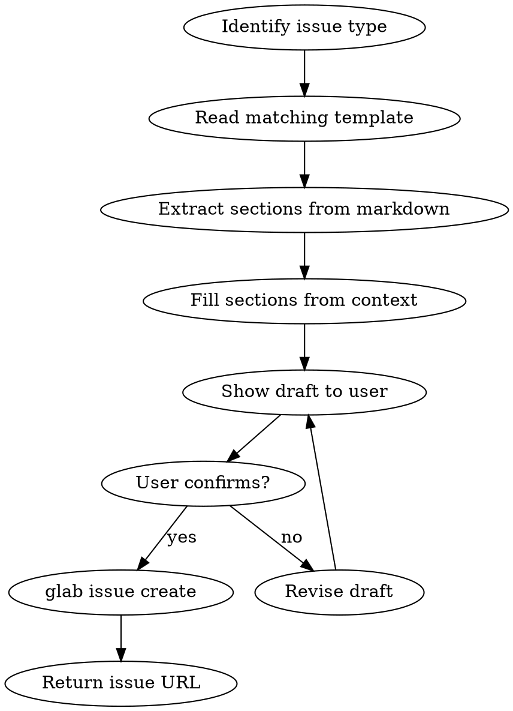

# GitLab Issue Creator

## Overview

Creates GitLab issues using the project's `.gitlab/issue_templates/*.md` files. Reads markdown templates to extract sections, fills them from context, and files via `glab issue create`.

## When to Use

- User asks to create/file a GitLab issue
- User reports a bug, requests a feature, or identifies a security policy gap
- User wants to track work from a VlamGuard report as issues
- User says "open an issue", "file a bug", "create a ticket" in a GitLab project

**When NOT to use:** GitHub projects (use `gh issue create` instead), or when user just wants to discuss without filing.

## Quick Reference

| Template | Trigger | Labels |
|----------|---------|--------|
| `bug_report.md` | Bug, error, unexpected behavior | `bug` |
| `feature_request.md` | New feature, enhancement, improvement | `enhancement` |
| `security_vulnerability.md` | Missing policy check, security gap | `security`, `policy` |

## Workflow



### Steps

1. **Identify template**: Match user intent to `bug_report`, `feature_request`, or `security_vulnerability`
2. **Read template**: Parse `.gitlab/issue_templates/<template>.md` to extract `## <Section>` headers and HTML comment metadata
3. **Extract metadata**: Read the HTML comment block at the top for `title:` prefix and `labels:` values
4. **Fill sections**: Use conversation context, VlamGuard output, or user-provided details to populate each `## <Section>`
5. **Use title prefix**: Templates specify `title:` in the HTML comment (e.g. `"[Bug]: "`) — always prepend this prefix
6. **Confirm**: Show the user the title, labels, and body draft before filing
7. **Create**: Use a heredoc for the description to avoid shell-quoting issues:
   ```bash
   glab issue create --title "<title>" --label "<label1>" --label "<label2>" --description "$(cat <<'EOF'
   <body content>
   EOF
   )"
   ```
   Note: Use separate `--label` flags for each label (not comma-separated).
8. **Return**: Display the issue URL

### GitLab Template Format

GitLab uses **markdown files** (not YAML forms like GitHub). Key differences:

| Aspect | GitHub | GitLab |
|--------|--------|--------|
| Format | YAML with `body:` array | Plain markdown with `## <Section>` |
| Metadata | YAML frontmatter (`title:`, `labels:`) | HTML comment block (`<!-- title: ... -->`) |
| Field types | `textarea`, `input`, `dropdown`, `markdown` | All sections are free-text markdown |
| Required fields | `validations.required: true` | Indicated by comments (no enforcement) |
| CLI tool | `gh issue create --body` | `glab issue create --description` |
| Dropdowns | Rendered as select widgets | Listed as options in comments — pick one and render as plain text |

### Body Format

Use `## <Section>` headers matching the template's markdown sections. Replace HTML comment placeholders with actual content.

For sections with enumerated options in comments (e.g. `<!-- One of: critical, high, medium -->`), pick the closest match and render as plain text.

For sections with code fences (e.g. ` ```yaml ` blocks), fill the code fence with actual content or remove if not applicable.

- **Unknown/blank fields**: If a required section has no context, write "Not provided — please fill in" rather than leaving empty. For optional sections, use "N/A".

### Batch Issues

When creating multiple issues in one session:
1. Prioritize by severity: security > bug > feature
2. Show all drafts to user for confirmation before filing any
3. Create one at a time, returning each URL

### Template Classification

- `security_vulnerability`: for **missing** checks (VlamGuard should catch something it doesn't)
- `bug_report`: for **misfiring** checks (false positives, crashes, wrong results on existing checks)
- `feature_request`: for **new capabilities** (new CRD types, new output formats, new commands)

## Common Mistakes

- **Skipping confirmation**: Always show draft before filing. User may want to adjust.
- **Wrong CLI flag**: GitLab uses `--description`, not `--body`. Use `glab`, not `gh`.
- **Ignoring HTML comment metadata**: The `<!-- title: ..., labels: ... -->` block contains the title prefix and labels.
- **Wrong template**: A performance complaint is a bug, not a feature request. When ambiguous, prefer: security > bug > feature.
- **Hardcoded labels**: Read labels from the template's HTML comment, don't guess.

## GitHub Adaptation

Replace `glab issue create --description` with `gh issue create --body`. GitHub uses `.github/ISSUE_TEMPLATE/*.yml` (YAML forms, not markdown). Parse YAML `body:` array for field types.
