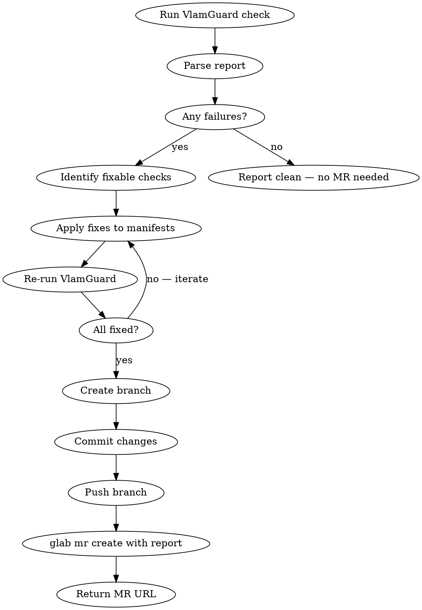

# VlamGuard MR Creator (GitLab)

## Overview

Runs VlamGuard analysis on Helm charts or manifests, applies recommended fixes, commits changes to a new branch, and opens a GitLab merge request with the full report embedded. GitLab equivalent of the `vlamguard-pr` skill.

## When to Use

- User asks to "fix and MR" based on VlamGuard findings in a GitLab project
- User wants to remediate policy check failures and open a merge request
- User says "run vlamguard and create an MR with fixes"
- After a `vlamguard check` shows failures that need remediation (GitLab repo)

**When NOT to use:** GitHub projects (use `vlamguard-pr` skill with `gh`), or if user only wants the report without code changes.

## Workflow



### Steps

1. **Run VlamGuard**: Execute `vlamguard check` (or `security-scan`) with `--output json` to get machine-readable results
2. **Parse findings**: Extract failed `policy_checks`, `hard_blocks`, `security` section, and `ai_context.recommendations`
3. **Identify fixes**: Map failures to concrete manifest changes:

| Check ID | Common Fix |
|----------|------------|
| `security_context` | Add `securityContext.runAsNonRoot: true`, `runAsUser: 1000` |
| `readonly_root_fs` | Add `securityContext.readOnlyRootFilesystem: true` |
| `resource_limits` | Add `resources.limits.cpu` and `resources.limits.memory` |
| `image_tag` | Replace `:latest` with specific tag |
| `allow_privilege_escalation` | Add `securityContext.allowPrivilegeEscalation: false` |
| `excessive_capabilities` | Add `securityContext.capabilities.drop: ["ALL"]` |
| `liveness_readiness_probes` | Add liveness and readiness probe definitions |
| `replica_count` | Set `replicas: >= 2` |
| `service_account_token` | Set `automountServiceAccountToken: false` |
| `host_namespace` | Set `hostNetwork: false`, `hostPID: false`, `hostIPC: false` |

For checks not in the table above, read the check's `remediation` field from the JSON output — it contains specific fix instructions. For CRD-specific checks, also see `src/vlamguard/engine/crd/<type>.py`. Common CRD fixes:

| CRD Check | Fix |
|-----------|-----|
| `keda_min_replica_production` | Set `spec.minReplicaCount: >= 1` |
| `istio_virtualservice_timeout` | Add `timeout: "30s"` to each `spec.http[]` route |
| `argocd_auto_sync_prune` | Set `spec.syncPolicy.automated.selfHeal: true` |
| `certmgr_certificate_duration` | Set `spec.duration` and `spec.renewBefore` |
| `eso_refresh_interval` | Set `spec.refreshInterval` to a non-zero value |

4. **Apply fixes**: Edit the values.yaml or manifest files directly
5. **Re-run VlamGuard**: Verify fixes resolved the failures. Compare before/after scores.
6. **Branch & commit**:
   ```bash
   git checkout -b fix/vlamguard-<short-description>
   git add <changed-files>
   git commit -m "fix: remediate VlamGuard policy failures

   Before: score=X, grade=Y, Z failures
   After:  score=X, grade=Y, Z failures"
   ```
7. **Open MR**: Use `.gitlab/merge_request_templates/vlamguard_remediation.md` format:
   ```bash
   glab mr create --title "fix: remediate VlamGuard policy failures" --description "$(cat <<'EOF'
   ## Summary
   Automated remediation of VlamGuard policy check failures.

   ## VlamGuard Report
   **Before:** Risk Score: X/100, Grade: Y, Z hard blocks
   **After:**  Risk Score: X/100, Grade: Y, 0 hard blocks

   ## Changes Made
   <list of manifest changes>

   ## Checks Addressed
   | Check ID | Before | After | Fix Applied |
   |----------|--------|-------|-------------|
   | ... | FAIL | PASS | ... |

   ## Test Plan
   - [x] VlamGuard check passes after fixes
   - [ ] Unit tests pass
   - [ ] Integration tests pass

   ## Compliance Impact
   <CIS/NSA/SOC2 changes if applicable, or "None">

   ---
   Generated with [VlamGuard](https://gitlab.com/elky-bachtiar/VlamGuard)
   EOF
   )"
   ```
8. **Return**: Display the MR URL

### GitLab vs GitHub Differences

| Aspect | GitHub (`vlamguard-pr`) | GitLab (`vlamguard-mr`) |
|--------|------------------------|------------------------|
| CLI tool | `gh pr create` | `glab mr create` |
| Body flag | `--body` | `--description` |
| Term | Pull Request (PR) | Merge Request (MR) |
| Template path | `.github/PULL_REQUEST_TEMPLATE.md` | `.gitlab/merge_request_templates/*.md` |
| Link format | `github.com` | `gitlab.com` |

## Fix Priority

Apply fixes in this order (highest impact first):

1. **Hard blocks** (critical severity) — these block the pipeline
2. **High severity** fails — significant security risk
3. **Medium severity** fails — best practice improvements
4. **AI recommendations** with `yaml_snippet` — ready-to-apply suggestions

## Clean Report (No Failures)

When VlamGuard reports all checks pass: **do not create an MR**. Instead:
1. Report the clean status to the user: "All 79 checks pass, score X/100, grade A — no remediation needed."
2. If the user still wants an MR (e.g. for audit trail), create one with just the report in the description and no code changes. Omit the "Checks Addressed" table and "Changes Made" sections — only include Summary, VlamGuard Report (current scores), and Test Plan.

## Handling AI yaml_snippets

AI `yaml_snippet` fields are **hints, not drop-in code**. Follow this process:

1. **Validate context**: Does the snippet make sense for this chart/manifest? If not, skip it and note in the MR description: "AI snippet for X skipped — not applicable to this chart."
2. **Determine placement**:
   - For Helm charts: add as new templates in `charts/<name>/templates/<resource>.yaml`, or enable via `values.yaml` if the chart already supports it (e.g. `networkPolicy.enabled: true`)
   - For raw manifests: create new files or append to existing multi-doc YAML
3. **Adapt, don't copy**: Adjust namespaces, labels, selectors, and references to match existing resources
4. **Verify**: Re-run VlamGuard after applying to confirm improvement

## Common Mistakes

- **Using `gh` instead of `glab`**: This is a GitLab skill — use `glab mr create`, not `gh pr create`
- **Using `--body` instead of `--description`**: GitLab CLI uses `--description` for MR body content
- **Fixing without re-running**: Always re-run VlamGuard after applying fixes to verify
- **Blind yaml_snippet application**: AI snippets are hints, not drop-in code — validate context
- **Committing to main**: Always create a feature branch
- **Missing before/after**: The MR description MUST show score comparison
- **Over-fixing**: Only fix what VlamGuard flagged. Don't refactor unrelated code.
- **Creating MR for clean report**: No failures = no MR needed (unless user explicitly asks)
- **Wrong link URL**: Use `gitlab.com`, not `github.com` in the generated footer
